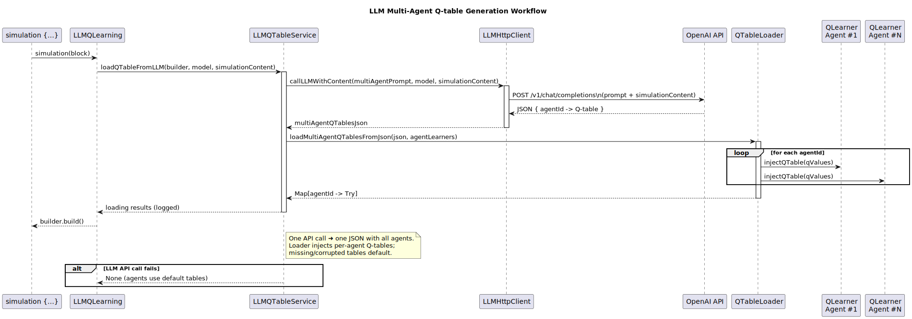

# LLM Integration: AI-Powered Reinforcement Learning

The LLM integration features represent an experimental approach to enhancing reinforcement learning through Large Language Model capabilities, including AI-powered Q-table generation and automatic environment design.

## Overview

This section covers two main LLM integration features:

1. **LLM Q-Learning**: Using AI to generate initial Q-tables for faster learning convergence
2. **Wall LLM**: Leveraging AI to create complex environment layouts from natural language descriptions

Both features integrate seamlessly with the MARL framework while providing optional AI enhancement capabilities.

## LLM Q-Learning: AI-Powered Initialization

### Concept and Motivation

Traditional Q-Learning starts with zero or optimistically initialized Q-values, requiring extensive exploration to discover good policies. LLM Q-Learning attempts to leverage the spatial reasoning capabilities of large language models to provide intelligent initial Q-tables.



### Implementation Architecture

**Core Components:**
- `LLMQLearning` trait: Provides LLM integration capabilities
- `QTableLoader`: Handles parsing and loading of LLM-generated Q-tables
- `LLMProperties`: DSL extensions for LLM configuration

### How It Works

**Step 1: Environment Analysis**
The system analyzes the grid environment, including:
- Grid dimensions and wall positions
- Agent starting positions and goals
- Obstacle (such as walls) configurations

**Step 2: Prompt Generation**
A structured prompt is created describing:
- The reinforcement learning scenario
- Grid layout with ASCII representation
- Optimal policy requirements
- Expected Q-table format
- Uses templates stored in `src/main/resources/prompts/`:
    
    **Multi-Agent Q-Table Generation** (`multi_agent_qtable_generation_prompt.txt`):
    - Handles complex multi-agent scenarios with coordination
    - Generates complete Q-tables for all grid states
    - Considers agent interactions and conflict avoidance
    - Supports 5 actions: Up, Down, Left, Right, Stay
    - Uses agent-specific optimization strategies


**Step 3: LLM Processing**
The prompt is sent to the configured LLM (typically GPT-4o) which:
- Analyzes the spatial layout
- Reasons about optimal paths
- Generates Q-values for state-action pairs
- Returns structured JSON Q-table data

**Step 4: Integration**
The generated Q-table is:
- Parsed and validated
- Loaded into the QLearner instance
- Used as initialization for continued learning

### Data Processing

The system handles various LLM output formats:

**Supported Formats:**
- Pure JSON Q-table data
- Markdown-wrapped JSON (common LLM output)
- Partial Q-tables (sparse initialization)
- Error handling for malformed responses

## Wall LLM: AI-Powered Environment Design

### Concept and Motivation

Creating interesting and challenging environments manually is time-consuming. Wall LLM enables natural language description of desired environments, with AI generating the corresponding wall configurations.

### Implementation Architecture

**Core Components:**
- `WallLLMProperty` enum: DSL properties for wall generation
- Natural language prompt processing
- Wall coordinate generation and validation

### How It Works

**Step 1: Natural Language Input**
Users describe desired environments in plain English:
- "Create a maze with multiple paths to the goal"
- "Design a corridor with strategic chokepoints"
- "Generate a complex obstacle course"

**Step 2: Prompt Engineering**
The system constructs prompts that:
- Describe the grid dimensions
- Explain wall coordinate format
- Provide context about agent positions
- Request specific layout characteristics
- Uses templates stored in `src/main/resources/prompts/`:

  **Wall Generation** (`walls_generation_prompt.txt`):
  - Creates ASCII-based grid environments from natural language
  - Ensures accessibility between start and goal positions
  - Generates interesting maze-like structures with strategic features
  - Maintains solvability while providing learning challenges

**Step 3: LLM Generation**
The LLM processes the request and:
- Understands spatial relationships
- Generates wall coordinate lists
- Ensures paths remain accessible
- Creates interesting challenge patterns

**Step 4: Validation and Integration**
Generated walls are:
- Validated for grid boundaries
- Checked for accessibility
- Integrated into the environment
- Visualized for verification


## Testing Strategy

... TODO

### DSL Integration

LLM Q-Learning and Wall Generation introduces new DSL keywords:

**New Keywords:**
- `useLLM` - Configure LLM-enhanced Q-learning
  - `Enabled` - Toggle LLM features on/off
  - `Model` - Specify which LLM model to use
- `wallsFromLLM` - Generate environment walls using LLM
  - `Model` - Specify which LLM model to use
  - `Prompt` - Custom prompt for LLM generation

```scala
// LLM Q-table generation
simulation:
  useLLM:
    Enabled >> true
    Model >> "gpt-4o"
  

// LLM wall generation
simulation:
  wallsFromLLM:
    Model >> "gpt-4o"
    Prompt >> "Create a challenging maze..."

```

## Key Insights

### Technical Achievements

1. **Seamless Integration**: LLM features integrate naturally with existing architecture
2. **Robust Error Handling**: System remains stable despite LLM unpredictability
3. **Flexible Configuration**: DSL extensions maintain usability
4. **Comprehensive Testing**: Thorough validation ensures reliability

### Fundamental Limitations

1. **Policy Understanding**: LLMs lack deep understanding of optimal RL policies
2. **Spatial Reasoning**: Inconsistent performance on spatial optimization tasks
3. **Domain Knowledge**: Limited understanding of RL-specific design principles
4. **Consistency**: High variability in output quality