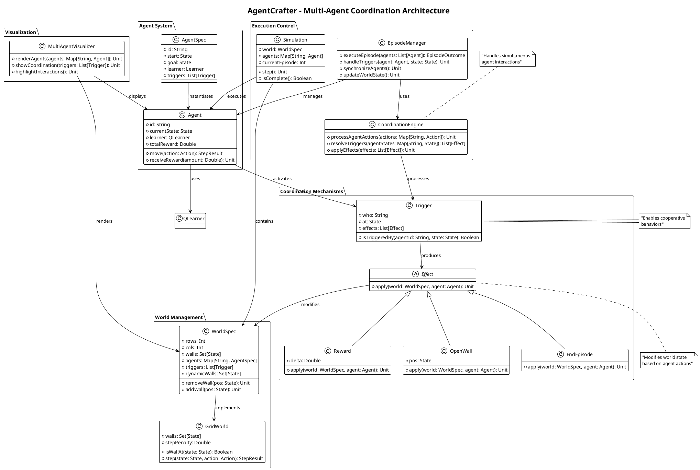

# Multi-Agent Reinforcement Learning (MARL)

The **Multi-Agent Reinforcement Learning (MARL)** framework is the core foundation of the AgentCrafter project. It provides a sophisticated, DSL-based approach to defining and executing multi-agent reinforcement learning simulations with advanced coordination mechanisms.

## Overview

This framework represents the culmination of reinforcement learning evolution in the project, implementing a powerful Domain-Specific Language (DSL) that allows for intuitive definition of complex multi-agent scenarios with cooperative behaviors, environmental interactions, and advanced learning strategies.

## Architecture Overview

The MARL framework is built on a sophisticated multi-agent coordination architecture that enables complex cooperative behaviors and learning strategies.

### Multi-Agent Coordination Architecture

The following diagram illustrates how multiple agents coordinate through triggers, effects, and shared world state:



### Learning Architecture for Multi-Agent Systems

This diagram shows how the Q-Learning components work together in a multi-agent environment:

```plantuml
@startuml MARL Learning Architecture
!theme plain
title Multi-Agent Reinforcement Learning - Learning Architecture

package "Learning Core" {
  abstract class Learner {
    +learn(episodes: Int): Unit
    +greedyEpisode(): EpisodeOutcome
    +reset(): State
    +step(state: State, action: Action): StepResult
  }
  
  class QLearner {
    -qTable: Map[(State, Action), Double]
    -learningParameters: LearningParameters
    -goalState: State
    -goalReward: Double
    +learn(episodes: Int): Unit
    +greedyEpisode(): EpisodeOutcome
    +chooseAction(state: State, epsilon: Double): Action
    +updateQValue(state: State, action: Action, reward: Double, nextState: State): Unit
  }
  
  class LearningParameters {
    +alpha: Double
    +gamma: Double
    +eps0: Double
    +epsMin: Double
    +warm: Int
    +optimistic: Double
    +calculateEpsilon(episode: Int): Double
  }
  
  class MultiAgentQLearner {
    +agents: Map[String, QLearner]
    +coordinationRewards: Map[String, Double]
    +sharedExperience: Buffer[Experience]
    +learnCooperatively(episodes: Int): Unit
    +shareExperience(experience: Experience): Unit
  }
}

package "Environment" {
  interface Environment {
    +rows: Int
    +cols: Int
    +step(state: State, action: Action): StepResult
  }
  
  class GridWorld {
    +walls: Set[State]
    +stepPenalty: Double
    +step(state: State, action: Action): StepResult
    +isValidMove(from: State, to: State): Boolean
  }
  
  class State {
    +row: Int
    +col: Int
  }
  
  enum Action {
    UP
    DOWN
    LEFT
    RIGHT
  }
  
  class StepResult {
    +nextState: State
    +reward: Double
    +isTerminal: Boolean
  }
}

package "Coordination Learning" {
  class CooperativeReward {
    +baseReward: Double
    +cooperationBonus: Double
    +calculateReward(agentActions: Map[String, Action], triggers: List[Trigger]): Double
  }
  
  class ExperienceBuffer {
    +experiences: Buffer[Experience]
    +maxSize: Int
    +add(experience: Experience): Unit
    +sample(batchSize: Int): List[Experience]
    +clear(): Unit
  }
  
  class Experience {
    +agentId: String
    +state: State
    +action: Action
    +reward: Double
    +nextState: State
    +isTerminal: Boolean
  }
}

package "Execution Flow" {
  class EpisodeRunner {
    +runEpisode(learners: Map[String, QLearner]): EpisodeOutcome
    +collectExperiences(): List[Experience]
    +updateLearners(): Unit
  }
  
  class EpisodeOutcome {
    +totalSteps: Int
    +totalReward: Double
    +agentRewards: Map[String, Double]
    +success: Boolean
    +cooperationEvents: Int
  }
}

package "Visualization" {
  class LearningVisualizer {
    +showQValues(qTables: Map[String, Map[(State, Action), Double]]): Unit
    +displayLearningProgress(outcomes: List[EpisodeOutcome]): Unit
    +highlightCooperation(events: List[CooperationEvent]): Unit
  }
}

' Relationships
Learner <|-- QLearner
QLearner --> LearningParameters
MultiAgentQLearner --> QLearner : "manages multiple"
QLearner --> Environment
GridWorld --> Environment
Environment --> State
Environment --> Action
Environment --> StepResult
MultiAgentQLearner --> ExperienceBuffer
ExperienceBuffer --> Experience
CooperativeReward --> Experience
EpisodeRunner --> QLearner
EpisodeRunner --> EpisodeOutcome
LearningVisualizer --> QLearner
LearningVisualizer --> EpisodeOutcome

note top of MultiAgentQLearner : "Coordinates learning\nacross multiple agents"
note right of ExperienceBuffer : "Shared learning\nexperiences"
note bottom of CooperativeReward : "Rewards cooperative\nbehaviors"

@enduml
```



## Key Concepts

### Multi-Agent Coordination
- **Cooperative Learning**: Multiple agents working together to achieve shared objectives
- **Trigger Systems**: Environmental switches and triggers that require agent coordination
- **Shared State Management**: Synchronized state updates across multiple learning agents
- **Dynamic Interactions**: Real-time agent-to-agent and agent-to-environment interactions

### Advanced Learning Mechanisms
- **Q-Learning with Coordination**: Enhanced Q-Learning that considers multi-agent interactions
- **Configurable Parameters**: Flexible learning rates, exploration strategies, and reward structures
- **Policy Optimization**: Advanced algorithms for optimal policy discovery in multi-agent settings
- **Experience Sharing**: Mechanisms for agents to learn from each other's experiences

### Environment Complexity
- **Grid-Based Worlds**: Sophisticated 2D environments with walls, obstacles, and interactive elements
- **Trigger Mechanisms**: Switches, buttons, and conditional elements requiring coordination
- **Dynamic Rewards**: Context-aware reward systems that adapt to multi-agent behaviors
- **Scalable Scenarios**: Support for varying numbers of agents and environment complexities

## DSL Architecture

### Core DSL Components

The MARL framework is built around a powerful Scala 3 DSL that provides:

```scala
// Simulation Configuration
simulation(
  name = "CooperativeScenario",
  width = 10,
  height = 10,
  episodes = 1000
) {
  // Agent definitions with learning parameters
  agent("Agent1") {
    position = (0, 0)
    learningRate = 0.1
    explorationRate = 0.3
  }
  
  agent("Agent2") {
    position = (9, 9)
    learningRate = 0.1
    explorationRate = 0.3
  }
  
  // Environmental elements
  walls {
    line(from = (2, 0), to = (2, 5))
    line(from = (7, 4), to = (7, 9))
  }
  
  // Coordination triggers
  trigger("Switch1") {
    position = (3, 3)
    requiresAgents = 2
    reward = 100
  }
}
```

### Property System

The DSL uses a sophisticated property system with the following enums:

- **SimulationProperty**: `Name`, `Width`, `Height`, `Episodes`, `MaxSteps`
- **AgentProperty**: `Position`, `LearningRate`, `DiscountFactor`, `ExplorationRate`, `ExplorationDecay`
- **WallProperty**: `From`, `To`
- **TriggerProperty**: `Position`, `RequiredAgents`, `Reward`, `Penalty`
- **LearnerProperty**: `LearningRate`, `DiscountFactor`, `ExplorationRate`, `ExplorationDecay`

### Configuration Classes

The framework uses type-safe configuration classes:

```scala
case class LearnerConfig(
  learningRate: Double = 0.1,
  discountFactor: Double = 0.9,
  explorationRate: Double = 0.1,
  explorationDecay: Double = 0.995
)

case class LineWallConfig(
  from: (Int, Int),
  to: (Int, Int)
)
```

## Implementation Architecture

### Core Classes

1. **SimulationDSL**: The main DSL interface providing the simulation builder pattern
2. **Properties**: Comprehensive property definitions for all simulation elements
3. **Domain Models**: Type-safe representations of agents, environments, and interactions
4. **Builders**: Fluent API builders for constructing complex scenarios
5. **Execution Engine**: Runtime system for executing multi-agent simulations

### Learning Algorithms

The framework implements several advanced algorithms:

- **Multi-Agent Q-Learning**: Coordinated Q-Learning with shared state considerations
- **Cooperative Q-Learning**: Algorithms specifically designed for cooperative scenarios
- **Experience Replay**: Shared experience buffers for accelerated learning
- **Policy Gradient Methods**: Advanced policy optimization techniques

### Coordination Mechanisms

- **Trigger Systems**: Environmental elements requiring multi-agent coordination
- **Shared Rewards**: Reward structures that encourage cooperation
- **Communication Protocols**: Implicit and explicit agent communication
- **Synchronization**: Coordinated action execution and state updates

## Advanced Features

### Scenario Complexity
- **Labyrinth Navigation**: Complex maze-solving with multiple agents
- **Treasure Hunt**: Cooperative resource collection scenarios
- **Switch Coordination**: Multi-agent puzzle solving with triggers
- **Dynamic Environments**: Changing environments that require adaptation

### Performance Optimization
- **Parallel Execution**: Multi-threaded simulation execution
- **Memory Efficiency**: Optimized state representation and storage
- **Scalable Architecture**: Support for large numbers of agents and complex environments
- **Real-time Monitoring**: Live performance metrics and learning progress tracking

### Integration Capabilities
- **LLM Extensions**: Seamless integration with LLM-powered features
- **Visualization**: Real-time rendering of multi-agent interactions
- **Testing Framework**: Comprehensive BDD testing with Cucumber
- **Export/Import**: Scenario serialization and sharing capabilities

## Example Scenarios

### Cooperative Labyrinth
```scala
// Multi-agent maze navigation requiring coordination
val cooperativeLabyrinth = simulation(
  name = "CooperativeLabyrinth",
  width = 15,
  height = 15,
  episodes = 2000
) {
  // Multiple agents with different starting positions
  agent("Explorer1") { position = (0, 0) }
  agent("Explorer2") { position = (14, 14) }
  
  // Complex wall structure
  walls {
    // Maze walls requiring coordination to navigate
  }
  
  // Coordination triggers
  trigger("Gate1") {
    position = (7, 7)
    requiresAgents = 2
    reward = 200
  }
}
```

### Multi-Agent Treasure Hunt
```scala
// Cooperative resource collection scenario
val treasureHunt = simulation(
  name = "TreasureHunt",
  width = 12,
  height = 12,
  episodes = 1500
) {
  agent("Hunter1") { position = (0, 0) }
  agent("Hunter2") { position = (11, 11) }
  agent("Hunter3") { position = (0, 11) }
  
  // Multiple coordination points
  trigger("Treasure1") {
    position = (6, 6)
    requiresAgents = 3
    reward = 500
  }
}
```

## Performance and Scalability

### Optimization Features
- **Efficient State Representation**: Optimized memory usage for large environments
- **Parallel Learning**: Multi-threaded Q-Table updates and policy optimization
- **Adaptive Exploration**: Dynamic exploration strategies based on learning progress
- **Smart Coordination**: Efficient algorithms for multi-agent coordination

### Scalability Metrics
- **Agent Scaling**: Tested with up to 10+ agents in complex scenarios
- **Environment Size**: Supports environments up to 50x50 grids
- **Episode Performance**: Optimized for thousands of learning episodes
- **Memory Efficiency**: Minimal memory footprint even with large Q-Tables

## Integration with LLM Features

The MARL framework seamlessly integrates with LLM-powered extensions:

- **LLM Q-Table Initialization**: AI-generated starting policies for faster convergence
- **LLM Wall Generation**: Automatic environment creation using natural language
- **Intelligent Scenario Design**: AI-assisted scenario configuration and optimization

## Testing and Validation

The framework includes comprehensive testing:

- **Unit Tests**: Core algorithm and DSL functionality testing
- **Integration Tests**: Multi-agent coordination and scenario execution
- **BDD Testing**: Cucumber-based behavior-driven development
- **Performance Tests**: Scalability and optimization validation

---

*The MARL framework represents the state-of-the-art in multi-agent reinforcement learning, providing a powerful, flexible, and scalable foundation for complex AI scenarios with seamless LLM integration capabilities.*