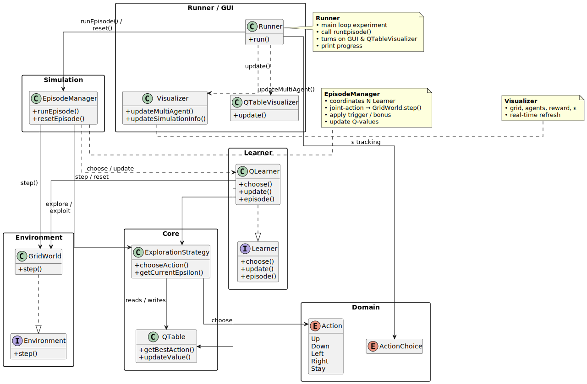

# Multi-Agent Reinforcement Learning (MARL)

The MARL framework extends the foundational Q-Learning implementation to support multiple coordinated agents working together in complex environments with triggers/switches and dynamic interactions.

## What's Beyond Basic Q-Learning?

While basic Q-Learning handles single agents in static environments, MARL adds:

### Multi-Agent Coordination
- **Simultaneous Learning**: Multiple agents learning and acting concurrently
- **Shared Environment**: Agents affect each other's state transitions and rewards
- **Coordination Mechanisms**: Switches requiring collaborative activation

### Dynamic Environment Features
- **Trigger Systems**: Environmental elements that respond to agent actions
- **Wall Removal**: Dynamic environment modification based on agent coordination
- **Conditional Rewards**: Context-aware reward systems responding to multi-agent behaviors

### Enhanced DSL

The DSL evolved from simple single-agent configuration to sophisticated multi-agent scenario definition:

**Option 1: Structured Wall Definition**
```scala
simulation:
  grid:
    8 x 12

  walls:
    line:
      Direction >> "vertical"
      From >> (1, 6)
      To >> (6, 6)
    Block >> (2, 2)
    Block >> (3, 2)
    Block >> (5, 9)
    Block >> (6, 9)

  agent:
    Name >> "Opener"
    Start >> (1, 1)
    withLearner:
      Alpha >> 0.15
      Gamma >> 0.9
      Eps0 >> 0.8
      EpsMin >> 0.1
      Warm >> 1_500
      Optimistic >> 0.5
    Goal >> (6, 2)
    onGoal:
      Give >> 25.0
      OpenWall >> (4, 6)
      EndEpisode >> false

  agent:
    Name >> "Runner"
    Start >> (1, 2)
    withLearner:
      Alpha >> 0.15
      Gamma >> 0.9
      Eps0 >> 0.8
      EpsMin >> 0.1
      Warm >> 1_500
      Optimistic >> 0.5
    Goal >> (6, 10)
    onGoal:
      Give >> 55.0
      EndEpisode >> true
  Penalty >> -3.0
  Episodes >> 12_000
  Steps >> 300
  ShowAfter >> 10_000
  Delay >> 100
  WithGUI >> true
```

**Option 2: ASCII Wall Definition**
```scala
simulation:
  grid:
    10 x 8

  asciiWalls:
    """########
      |#..##..#
      |#.####.#
      |#.#.#..#
      |#.#.#..#
      |########
      |#......#
      |########
      |#......#
      |########"""

  agent:
    Name >> "WallOpener1"
    Start >> (1, 1)
    withLearner:
      Alpha >> 0.15
      Gamma >> 0.95
      Eps0 >> 0.9
      EpsMin >> 0.05
      Warm >> 3_000
      Optimistic >> 1.0
    Goal >> (4, 1)
    onGoal:
      Give >> 70.0
      OpenWall >> (7, 5)
      EndEpisode >> false

  agent:
    Name >> "Hunter"
    Start >> (8, 1)
    withLearner:
      Alpha >> 0.15
      Gamma >> 0.95
      Eps0 >> 0.9
      EpsMin >> 0.05
      Warm >> 3_000
      Optimistic >> 0.5
    Goal >> (4, 3)
    onGoal:
      Give >> 100.0
      EndEpisode >> true
  Penalty >> -3.0
  Episodes >> 20_000
  Steps >> 600
  ShowAfter >> 17_000
  Delay >> 150
  WithGUI >> true
```

These examples demonstrate two different approaches for defining walls in multi-agent scenarios:
- **Structured walls**: Use `walls:` with `line:` and `Block` elements for environment design
- **ASCII walls**: Use `asciiWalls:` with visual string representation for intuitive environment design

Both showcase cooperative multi-agent scenarios with hierarchical DSL syntax, `withLearner` blocks, and coordination triggers as used in the actual codebase.

**DSL Enhancements:**
- Multiple agent definitions with individual configurations
- Trigger and switch specifications
- Coordination requirements

## Implementation Architecture




The MARL framework introduces a sophisticated architecture that extends the basic Q-Learning foundation with specialized components for multi-agent coordination. The system is built around a modular design that separates concerns while enabling complex agent interactions.

#### Key Architectural Components:

**Manager Layer:**
- **EpisodeManager**: Orchestrates complete episode execution, coordinating all other managers
- **AgentManager**: Handles agent state, action selection, and Q-learning updates for all agents
- **EnvironmentManager**: Manages dynamic environment state, walls, and trigger processing
- **VisualizationManager**: Controls real-time visualization and Q-table displays
  
**DSL Framework:**
- **SimulationDSL**: Main DSL interface providing declarative scenario definition
- **Property Enums**: Type-safe configuration properties (Agent, Learner, Trigger, Wall, Simulation)

**Builder Pattern:**
- **SimulationBuilder**: Fluent API for constructing complete multi-agent scenarios
- **AgentBuilder**: Individual agent configuration with learning parameters
- **TriggerBuilder**: Dynamic trigger and effect system configuration
- **WallLineBuilder**: Flexible wall creation with line and block patterns


## Testing Strategy

### Unit Tests

- Multi-agent coordination
- Trigger activation and effects
- Episode termination conditions
