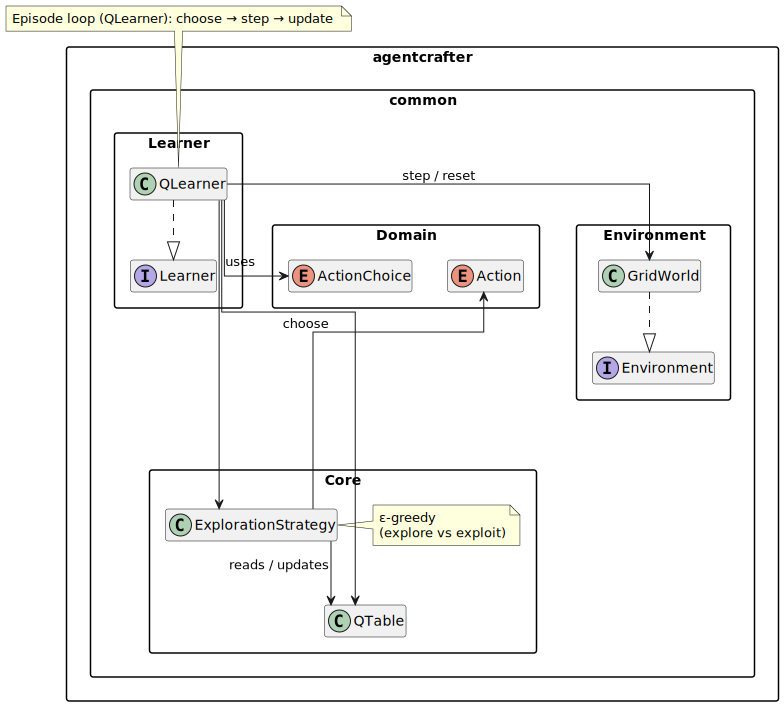
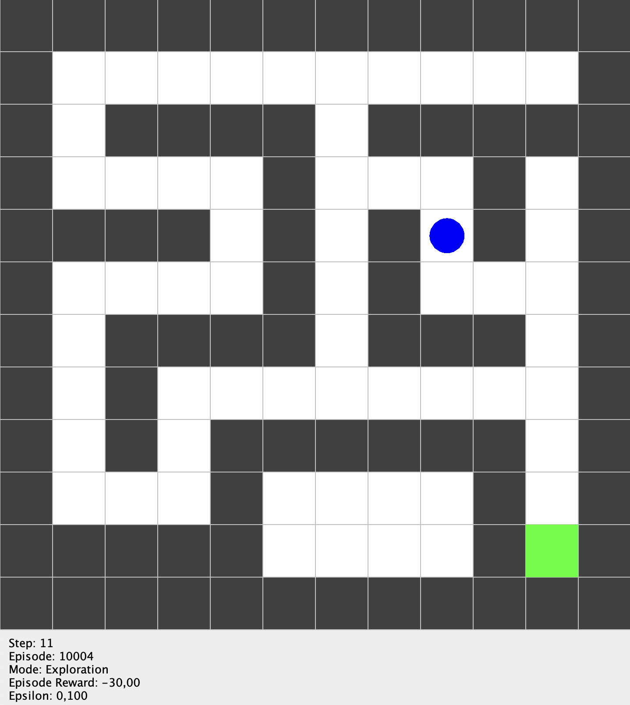

# Q-Learning: Foundation and Visualization

This section covers the foundational Q-Learning implementation that forms the core of the AgentCrafter framework, including both basic grid-based learning and advanced visualization capabilities.

## Development Journey

The Q-Learning implementation evolved through several key phases:

1. **Grid Q-Learning** - Core reinforcement learning algorithms and grid-based environments
2. **Visual Q-Learning** - Real-time visualization and monitoring capabilities  
3. **First DSL Version** - Initial domain-specific language for simulation configuration
4. **Unit Tests** - Comprehensive testing to validate implementation correctness

## Core Implementation

### Grid-Based Learning

The foundation is built on a discrete grid world environment where agents learn optimal policies through Q-Learning:



**Key Components:**
- `GridWorld`: Discrete environment with configurable walls and penalties
- `QLearner`: Core Q-Learning algorithm with epsilon-greedy exploration
- `State` and `Action`: Fundamental types for position and movement
- `LearningConfig`: Configurable parameters for learning behavior

### Learning Algorithm

The Q-Learning implementation follows the classical algorithm:

$$
\text{newValue}  = (1-\alpha)\,\text{currentValue} + \alpha\bigl(r + \gamma\,\text{maxNextValue}\bigr)
$$

Parameters:
- currentValue $Q_{\text{old}}(s,a)$: the agent’s current estimate of the value of taking action a in state s. 
- r (reward): the immediate scalar reward returned by the environment after executing action a in state s.
- maxNextValue $\displaystyle\max_{a’} Q_{\text{old}}(s’,a’)$: the highest estimated value among all actions $a′$ available in the next state $s′$, providing a one-step look-ahead toward the future.
- $\alpha$ (alpha): learning rate, $0 < \alpha \le 1$; how strongly new information overrides the old estimate.
- $\gamma$ (gamma): discount factor, $0 \le \gamma < 1$; weights future rewards relative to the immediate reward.
- newValue $Q_{\text{new}}(s,a)$: the value stored back into the Q-table, moving $Q(s,a)$ toward the optimal action–value function through repeated updates.

**Learning Parameters:**
- **Alpha ($α$)**: Learning rate controlling how much new information overwrites old
- **Gamma ($γ$)**: Discount factor determining importance of future rewards
- **Epsilon ($ε$)**: Exploration rate with decay from eps0 to epsMin over warm-up period
- **Optimistic Initialization**: Starting Q-values to encourage exploration

### Environment Dynamics

The grid world provides:
- **Movement Actions**: Up, Down, Left, Right, Stay
- **Wall Collision**: Blocked movements return agent to current position
- **Step Penalties**: Negative reward for each action to encourage efficiency
- **Goal Rewards**: Positive reward when reaching target state

## Visual Learning Enhancement

### Real-Time Visualization

The visual component adds comprehensive monitoring capabilities:



**Visualization Features:**
- **Live Agent Movement**: Real-time display of agent position and trajectory
- **Q-Value Display**: Current Q-values for debugging and analysis
- **Exploration Mode**: Visual indication of exploration vs exploitation
- **Episode Statistics**: Step count, rewards, and success metrics

### Interactive Debugging

The visualization system enables:
- **Step-by-Step Analysis**: Pause and examine individual decisions
- **Policy Visualization**: Display of learned policy across the grid
- **Learning Progress**: Real-time tracking of convergence
- **Parameter Tuning**: Visual feedback for hyperparameter optimization

## DSL Foundation

The initial DSL provided basic simulation configuration:

```dsl
simulation:
  grid:
    5 x 5
  wall:
    (2, 2)
  agent:
    Start >> (0, 0)
    Goal >> (4, 4)
  Episodes >> 100
  Steps >> 50
  GoalReward >> 10
  WithGUI >> true
```
This example uses the same DSL syntax style as the Scala example, with indentation and property assignment, but remains minimal and single-agent.

**Early DSL Features:**
- Simple agent configuration
- Basic environment setup
- Learning parameter specification
- Episode and step limits

## Testing Strategy

### Unit Tests

Comprehensive testing validates:

**Test Coverage:**
- Q-Learning algorithm correctness
- Environment state transitions
- Parameter handling and validation
- Edge cases and boundary conditions
